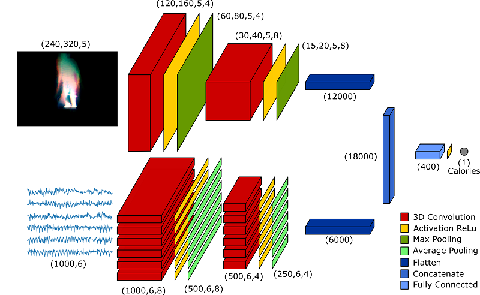
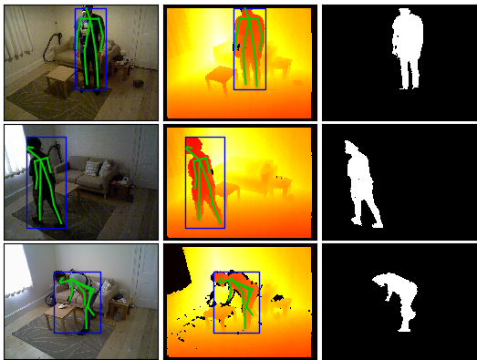
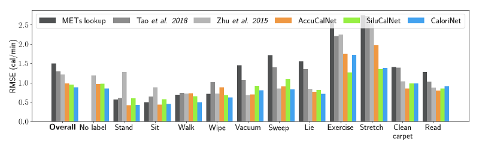

# CaloriNet: From silhouettes to calorie estimation in private environments
We propose a novel deep fusion architecture, CaloriNet, for the online estimation of energy expenditure for free living monitoring in private environments, where RGB data is discarded and replaced by silhouettes. Our fused convolutional neural network architecture is trainable end-to-end, to estimate calorie expenditure, using temporal foreground silhouettes alongside accelerometer data. The network is trained and cross-validated based on a publicly available dataset, SPHERE-Calorie, linking RGB-D, inertial and calorific measurements. Results show state-of-the-art minimum error on the estimation of energy expenditure (calories per minute), outperforming alternative, standard and single-modal techniques.



## Content and pipeline
In order to reproduce our results, the following pipeline should be followed:
1. Download the [SPHERE-Calorie](https://data.bris.ac.uk/data/dataset/1gt0wgkqgljn21jjgqoq8enprr) dataset. A data request form must be filled in to download the data.
2. Unzip all the `depth.zip`, `rgb.zip` and `label.zip` contained in each `Subject*_Record*` folder
3. Run [OpenPose](https://github.com/CMU-Perceptual-Computing-Lab/openpose) on all the RGB images of each subject to find the skeleton joints
4. Run `generate_silhouettes_rgbd.m` to convert the RGB images into silhouettes
5. Run `generate_avg_silhouette.py` to create the time-averaged silhouettes
6. Run `create_files_crossvalidation_CaloriNet.py` to create the training files for the cross validation. Ten different files will be created, each one is already configured for cross-validation on a different subject.
7. Run all the `CaloriNet_leave_*_out.py` files to train the 10 different networks used for cross-validation
8. Run `plot_results_CaloriNet.py` and `plot_final_results.py` to display the results

### Description of files
The following files are provided:

- `generate_silhouettes_rgbd.m`: Matlab script used to convert RGB images into silhouettes
- `generate_avg_silhouette.py`: Python script to create multi-scale temporale silhouettes (the network input)
- `create_files_crossvalidation_*.py`: Available for _CaloriNet_, _SiluCalNet_ and _AccuCalNet_, script that generates the cross-validation training networks
- `template_validation_*.py`: The template file used by the above script
- `plot_final_results.py`: Plot the final figure comparing all the results together

Additional files:

- `ImgCache.py`: Support class for `generate_avg_silhouette.py` to read images into memory using a cache
- `CaloriesDataset.py`: Set of Python functions used to read the `.npz` archives containing the pre-processed dataset
- `investigate_dataset.py`: Displays a figure of the calories dataset (as shown in the paper)
- `NetworkArchitectures.py`: Python script containing all the network architectures used in the paper
- `plot_crossvalidation_loss.py`: Plot the training and validation loss for each network
- `plot_error_vs_buffersize.py`: Plot the error vs the buffersize (as shown in the paper)
- `plot_prediction_case.py`: Plot a figure with the comparison between the ground truth and the calories prediction for different algorithms (as shown in the paper)
- `PlotLearning`: Keras callback function to show training and validation losses during training
- `SaveHistory.py`: Keras callback function to save the history of training and validation losses 

### Generation of silhouttes from RGB images
Before generating the silhouettes, the RGB images in the dataset must be processed with [OpenPose](https://github.com/CMU-Perceptual-Computing-Lab/openpose) to detect skeleton joints. Once skeletons are detected, silhouettes are generated with the matlab script `generate_silhouettes_rgbd.m`. Simply edit the script to adjust your data path and run it in Matlab. The script will generate a new folder for each subject in the dataset containing silhouettes in `.png` format.



### Generation of multi-scale temporal silhouettes
As described in the paper, the input of the network is constituted by time-averaged silhouettes. This task is performed by `generate_avg_silhouette.py`. This script reads the calories file and for each calorie measurement selects a buffer of silhouettes which are averaged together. The output of this script is a set of `.npz` files which are used for training the networks. To work with this archives, a few functions are provided in the `CaloriesDataset.py` file.

### Cross-validation
To replicate the results shown in the paper, 10 different networks must be trained. Each network is trained on 9 subjects and validated on the 10th. To allow the use of  HPC clusters, the script provided in `create_files_crossvalidation_CaloriNet.py` automatically creates the 10 different files used for training. The files are based on the template `template_validation_CaloriNet.py`, with the training and testing data automatically adjusted. Together with the training files, the `create_files` script also generates some bash script files that can be used to submit the jobs on an HPC cluster.

### Plotting the results
In order to test the network and predict the calorie estimation, the file `plot_results_CaloriNet.py` should be used. This script loads all the trained networks and test them one by one, producing a plot of the measured vs. estimated calories burnt. In addition to this, a `.dat` file containing a summary of the results is saved as well. This file is used in `plot_final_results.py` to generate the final figure containing a comparison of all the methods.

### AccuCalNet and SiluCalNet
The above pipeline can be easily adjusted to replicate the results for AccuCalNet and SiluCalNet. Simply follow the above steps running the `_AccuCalNet` or `_SiluCalNet` as needed.


## Results



## Citation
Please cite this paper in your work if it helps your research:

```
@inproceedings{masullo2018calories,
  author = {Alessandro Masullo and Tilo Burghardt and Dima Damen and Sion Hannuna and Victor Ponce-Lopez and Majid Mirmehdi},
  booktitle = {BMVC},
  title = {CaloriNet: From silhouettes to calorie estimation in private environments},
  year = {2018}
}
```
